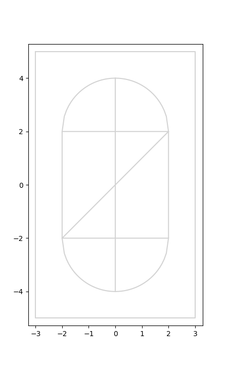

# robsim

Simulator for Intro to Intelligent Robotics.

Using map:

# USAGE

Implement your robot logic in a separate python file (I'd recommend copying the `robots.py` file and using it as a starting point). To simulate it, run

`./robsim.py your-robot-file.py`

For instance, to run the test robot in `robot.py`, you would run

`./robsim.py robot.py`

# Robot API

The simulator expects the following to be defined in your implementation:

* `INITIAL_POSE` - a three-tuple that defines the starting (x, y, theta) of the robot.
* `init(dt, list_of_waypoints)` - a function that will accept the delta time, and waypoints of the robots path. Only is called once at the beginning of the simulation, so make sure to assign the list to a variable or something.
* `update(beacons)` - the main function for the robot. Called every tick (0.5 seconds), and expects the return value to be a tuple `(left_wheel_velocity, right_wheel_velocity)`. `beacons` is a list of distance readings to the beacons in the order (nw, ne, se, sw)

# Configuration

    "dt": delta time for a clock tick
    "path_width": width of the map's path
    "robot_radius": radius of the robot
    "robot_axle_width": length of the robot axel
    "robot_max_speed": max wheel speed for the robot wheels
    "max_simulation_steps": max number of simulation steps to run before giving up
    "waypoint_tolerance": distance to waypoint to register as a waypoint hit
    "noise": {
        "use_noise": false to disable noise, true to enable it
        "wheel_slippage": std of wheel slippage
        "beacon_noise": std of beacon noise
        "beacon_drop_dist": distance to drop a beacon
           (beacon dropping is calculated by doing a normal dist with the spread set to the distance to the beacon)
           basically, set this number higher than the max distance to a beacon to have the farthest beacons drop out every
           once in a while.
    },
    "routes": an array of arrays of tuples specifying all the routes with their waypoints
